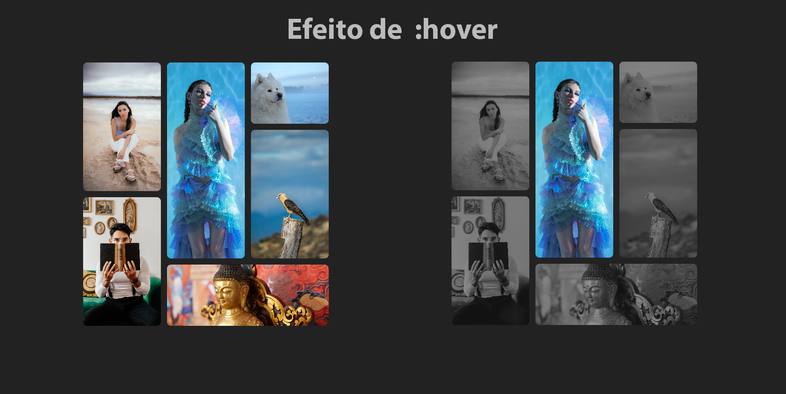

# Galeria de imagens feita apenas com HTML5 e CSS3

### Projeto feito para modelo de galeria usando <strong>HTML5 e CSS3</strong> usando css grid.

  <a href="#-tecnologias-utilizadas">Tecnologias</a> -
  <a href="#-resultado-aplicação-web">Resultado WEB</a> -
  <a href="#-como-executar">Como executar</a>

## Tecnologias utilizadas

### Tecnologias usadas no projeto.

  
  

## Resultado Aplicação WEB

## Como executar

Para executar a aplicação seguir os procedimentos abaixo:

-- Procedimento iniciar aplicação WEB --

Basta clonar o projeto e rodar o index.html
